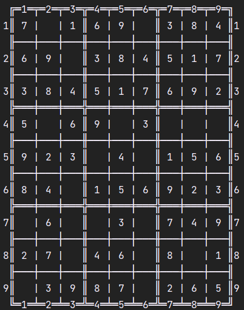
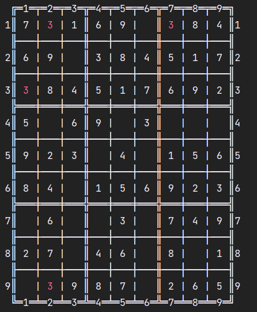
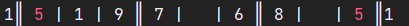

# CLI Sudoku

## Description

<a href="https://en.wikipedia.org/wiki/Sudoku" target="_blank">What is a Sudoku?</a>

### What can a user do with this program? 

__*Play a Sudoku puzzle utilizing their Command Line.*__ <a href="https://youtu.be/v676LL1DYCQ" target="_blank">Demonstration video</a>

#### Optional difficulties

- Easy 
- Medium 
- Hard 

#### Optional actions

- Inserting a value to a specified cell - *in case it was not defined at the beginning of the game, regardless of whether it has a value at the moment*
- Deleting a value from a specified cell - *in case it was not defined at the beginning of the game*
- Undoing a defined number of steps - *up to the number of insertions and deletions done since the last restart or the beginning of the game*
- Asking for a hint - *in case there are no repetitions, the program gives a suggestion to which cell what values could be written, prioritizing the cells where the number of possible values is the lowest*
- Restarting the game - *the user will be prompted to confirm their choice in order to avoid accidental restarts*
- Asking the program to finish the game - *after printing the finished the Sudoku, the program finishes*

#### Non-optional functions

- The program highlights all values that collide with another value in their row, column or block with red colour.

## Implementation

### Technologies used
- sbt 1.9.8 (Oracle Corporation Java 21.0.1)
- Scala 3.3.1 (11.0.19, Java OpenJDK 64-Bit Server VM)

### Data structure choices

Numbers (and the lack of them) in the Sudoku are represented as `Cell`s (= `Option[Int]`s).
They are stored in `Row`s (= `Vector[Cell]`), as they need to be sequenced and random access should be low-cost as insertions and deletions at any index will be frequent.
The Sudoku itself consist of `Vector`s of `Row`s, as this is the most intuitive option of the logical units (row, column and block), furthermore this representation will be very easy to use when printing the state of the Sudoku to the console.

The other logical units of Sudokus (`Column`s and `Block`s) are also represented as `Vector[Cell]`s, as they are basically needed for the same validations as `Row`s.
They can easily be retrieved from the rows with the use of mathematical functions. 
We can define the set of coordinates of the `n`th column with the following formula: `{ (i,n) | i ∈ {0 to 8} }`
We can define the set of coordinates of the `n`th block with following formula: `{ ((n / 3 * 3 + i) | i ∈ {0,1,2} } x { ((n % 3 * 3 + i) | i ∈ {0,1,2} }`

In order to track changes in specified `Cell`s, and easily access them, type `Cellhistory = Vector[(Int, Int, Cell)]` is introduced. The first Int is the row index, while the second is the column index in the Tuples. 

### File structure

The project consists of the following files:
- Sudoku - *Definition of types and methods*
- Validation - *Function definitions for checking whether a logical unit consists valid values, is repetition-free and is solved*
- Solving - *Function definitions that are needed for solving the Sudoku*
- Generate - *Function definitions that are needed for generating Sudokus with a defined difficulty level*
- Pretty - *Function definitions needed for printing the current state of the Sudoku to the console*
- PlaySudoku - *The core logic of the game, function definitions that parse and execute the user commands*
- Examples - *Sudokus that are used for testing the accuracy of functions*
- ValidationTests - *Unit tests for validation and solving methods*
- PlaySudokuTests - *Unit tests for the methods defined in PlaySudoku*
- main - *For running the game*
- Misc - *Prototypes or other methods that were not used in the final game but would not want to discard*
- README and intro and pictures - *Markdown files required for the SC50 Final Project Submission and Graphics that are inserted into this file*


### Solving logic

The core logic of solving a Sudoku is similar to a backtracking algorithm. It chooses an empty `Cell` of the input Sudoku, and fills all possible values creating new Sudokus, which will be added to the Sudokus to process. The previous state and all the newly generated unsolved Sudokus are discarded. The tail-recursive function will call itself until a solved `Sudoku` is found, or there are no more `Sudoku`s that can be generated from the original input.

The time complexity of the algorithm is exponential but there are several heuristics, that aim to improve performance:
- The Sudokus that are in a more advanced state - which take less steps to solve or to identify as unsolvable - are placed at the beginning of the list, and will consequently be used earlier.
- The function identifies the `Cell`s for which there are the least amount of possible values that could be filled in without causing repetitions and fills one of those first.
- By default, the algorithm fills only a single `Cell` in every call, but this can lead to a lot of unnecessary validations. For instance, if the algorithm fills in a single-option cell it has to validate the Sudoku before proceeding. Then, if the next cell also has only a single option, we have to fill and validate again. With Sudokus in more advanced states, this can repeat over and over. Considering that the validation has to check every single cell of the Sudoku, optimizing this step could enhance the performance considerably. Instead, we could simply keep filling the single-option cells (without validating) until we have no more. Then we only validate once, at the end.
- To discard the unsolvable `Sudoku`s, we check if there is at least one empty `Cell` that can not be filled with any value without causing repetitions. This saves time of advancing unsolvable Sudokus.
- Checking whether a Sudoku is solved is only done when there are no empty `Cell`s in the Sudoku.

### Generating logic

The same algorithm is used to generate `Sudokus` as for solving them. If the function was initially given an empty `Sudoku`, it would always generate the same `Sudoku`. It is clear, that randomness needs to be built into the generating method, but if only one cell would be determined in the input of the function, it could only generate 9 different `Sudokus` (since it can have 9 different values). If at least two random values are inserted, either the values need to be different, or the position has to be restricted (meaning they cannot be in the same row, column and block). I chose the latter, and decided that choosing only 2 `Cell`s are not enough, as the games generated could still be too similar. If we want to insert more than 4 random values, in order to avoid generating unsolvable Sudokus, we need to introduce more restrictions, since determining the locations of these only based on being in different rows, columns and blocks is not sufficient. 

For example in the below Sudoku, if a `1` would be placed in the middle block anywhere else than the location of the `2`, it would cause a repetition, therefore it is an unsolvable Sudoku, even though all values are in different rows, columns and blocks.
```
 ╔═1═╤═2═╤═3═╦═4═╤═5═╤═6═╦═7═╤═8═╤═9═╗
1║   |   |   ║   |   |   ║   |   |   ║1
 ╟───┼───┼───╫───┼───┼───╫───┼───┼───╢
2║   |   |   ║ 1 |   |   ║   |   |   ║2
 ╟───┼───┼───╫───┼───┼───╫───┼───┼───╢
3║   |   |   ║   |   |   ║   |   |   ║3
 ╠═══╪═══╪═══╬═══╪═══╪═══╬═══╪═══╪═══╣
4║   | 1 |   ║   |   |   ║   |   |   ║4
 ╟───┼───┼───╫───┼───┼───╫───┼───┼───╢
5║   |   |   ║   | 2 |   ║   |   |   ║5
 ╟───┼───┼───╫───┼───┼───╫───┼───┼───╢
6║   |   |   ║   |   |   ║   | 1 |   ║6
 ╠═══╪═══╪═══╬═══╪═══╪═══╬═══╪═══╪═══╣
7║   |   |   ║   |   |   ║   |   |   ║7
 ╟───┼───┼───╫───┼───┼───╫───┼───┼───╢
8║   |   |   ║   |   |   ║   |   |   ║8
 ╟───┼───┼───╫───┼───┼───╫───┼───┼───╢
9║   |   |   ║   |   | 1 ║   |   |   ║9
 ╚═1═╧═2═╧═3═╩═4═╧═5═╧═6═╩═7═╧═8═╧═9═╝
```

As we previously chose that we do not restrict which values we will use to fill the cells, we need to carefully choose the cells we will fill. For this, we will introduce the definition of a "blocked cell". We call a cell blocked if there is a filled Cell in the same row, column or block.

With this definition all the `Cell`s in the middle `Block` of the above Sudoku are blocked. As we do not determine the value that will be filled to the specific cells, we have to avoid generating blocked Blocks. We can ensure this by leaving all Blocks empty that are affected by 2 rows and 2 columns. I chose the below layout for the determined `Cell`'s positions:
```
 ╔═1═╤═2═╤═3═╦═4═╤═5═╤═6═╦═7═╤═8═╤═9═╗
1║ X |   |   ║   |   |   ║   |   |   ║1
 ╟───┼───┼───╫───┼───┼───╫───┼───┼───╢
2║   |   |   ║   |   |   ║   |   |   ║2
 ╟───┼───┼───╫───┼───┼───╫───┼───┼───╢
3║   |   |   ║   |   |   ║ X |   |   ║3
 ╠═══╪═══╪═══╬═══╪═══╪═══╬═══╪═══╪═══╣
4║   | X |   ║   |   |   ║   |   |   ║4
 ╟───┼───┼───╫───┼───┼───╫───┼───┼───╢
5║   |   |   ║   | X |   ║   |   |   ║5
 ╟───┼───┼───╫───┼───┼───╫───┼───┼───╢
6║   |   |   ║   |   |   ║   |   |   ║6
 ╠═══╪═══╪═══╬═══╪═══╪═══╬═══╪═══╪═══╣
7║   |   |   ║   |   |   ║   |   |   ║7
 ╟───┼───┼───╫───┼───┼───╫───┼───┼───╢
8║   |   |   ║   |   | X ║   |   |   ║8
 ╟───┼───┼───╫───┼───┼───╫───┼───┼───╢
9║   |   |   ║   |   |   ║   |   | X ║9
 ╚═1═╧═2═╧═3═╩═4═╧═5═╧═6═╩═7═╧═8═╧═9═╝
```
In the below graphics
- X means, that the Cell is filled in
- the horizontal lines mark the blocked rows
- the vertical lines mark Cells blocked by the columns
- the slant lines mark the Cells only blocked by the blocks
- Empty Cells show where any value can be written
This showcases the most restricted version of this Sudoku, where all inserted values are the same. If any of the values inserted differs, the options will be less restricted, therefore filling these coordinates should not result in unsolvable Sudokus.
```
 ╔═1═╤═2═╤═3═╦═4═╤═5═╤═6═╦═7═╤═8═╤═9═╗
1║ ╳ | ┼ | ─ ║ ─ | ┼ | ┼ ║ | ┼ ─ | ┼ ║1
 ╟───┼───┼───╫───┼───┼───╫───┼───┼───╢
2║ | | | | \ ║   | | | | ║ | | \ | | ║2
 ╟───┼───┼───╫───┼───┼───╫───┼───┼───╢
3║ ┼ | ┼ | ─ ║ ─ | ┼ | ┼ ║ ╳ | ─ | ┼ ║3
 ╠═══╪═══╪═══╬═══╪═══╪═══╬═══╪═══╪═══╣
4║ ┼ | ╳ | ─ ║ ─ | ┼ | ┼ ║ ┼ | ─ | ┼ ║4
 ╟───┼───┼───╫───┼───┼───╫───┼───┼───╢
5║ ┼ | ┼ | ─ ║ ─ | ╳ | ┼ ║ ┼ | ─ | ┼ ║5
 ╟───┼───┼───╫───┼───┼───╫───┼───┼───╢
6║ | | | | \ ║ \ | | | | ║ | |   | | ║6
 ╠═══╪═══╪═══╬═══╪═══╪═══╬═══╪═══╪═══╣
7║ | | | |   ║ \ | | | | ║ | | \ | | ║7
 ╟───┼───┼───╫───┼───┼───╫───┼───┼───╢
8║ ┼ | ┼ | ─ ║ ─ | ┼ | ╳ ║ | ┼ ─ | ┼ ║8
 ╟───┼───┼───╫───┼───┼───╫───┼───┼───╢
9║ ┼ | ┼ | ─ ║ ─ | ┼ | ┼ ║ ┼ | ─ | ╳ ║9
 ╚═1═╧═2═╧═3═╩═4═╧═5═╧═6═╩═7═╧═8═╧═9═╝
```

For this reason, the above positions are filled with random values between 1 and 9 in the input `Sudoku` of the generating function. This way it can generate 9 to the power of 6 (= 531441) different `Sudoku`s which in my opinion is sufficient for this game. `System.nanoTime()` is used as the seed for random generation (but it can be configured freely).

### Visual representation

| The Sudokus are visually represented as seen below: | In case there are repetitions in the `Row`s, `Column`s or `Block`s, all numbers are highlighted with RED ANSI colour when printing the Sudoku to the console. It looks like this when being printed: |
|-----------------------------------------------------|------------------------------------------------------------------------------------------------------------------------------------------------------------------------------------------------------|
|                              |                                                                                                                                                                             |
ANSI (The American National Standards Institute) provides colour standards, for which there are escape sequences and colour codes defined, that can be embedded into the text to colour parts of it.
The unicode escape sequence is `\u001B`. The ANSI colour codes start with this escape code. For example the code for red is `\u001B[31m`, while the reset code is `\u001B[0m`. If we want to colour some text red, then we need to insert the code for red before it, and the reset code after it. The reset code is needed to switch back to the default colour for the following text.
For example to print this:  we could write the following code:
``` 
"1║ " + "\u001B[31m" + "5" + "\u001B[0m" + " | 1 | 9 ║ 7 |   | 6 ║ 8 |   | " + "\u001B[31m" + "5" + "\u001B[0m" + " ║1"
```
This way if we collect the coordinates of colliding values, we can colour them while pretty printing.

### CLI interface

The core function of the game parses the user command and will call itself with the updated Sudoku or the previous state of the Sudoku - depending on whether the command was executed. The function returns when the Sudoku is solved.

This core function relies on the below data:
- the current State of the Sudoku - *on which the successful commands will be done*
- the starting state of the Sudoku - *as the cells that are defined at the beginning cannot be changed*
- past changes of the Sudoku - *documenting the values the insertions and deletions are changing are needed for the implementation of the undo command.*

The commands are represented with the below case classes which extend the sealed trait Command:
- Insert - *which has 3 fields: rowIx, colIx, value - as inserting requires the coordinate where to insert and a value to insert*
- Delete - *which has 2 fields: rowIx, colIx - as deletion only needs the coordinate of the Cell the value of which should be set to None*
- Undo *which has 1 filed: number of steps to be undone*
- Restart - *with no fields*
- Finish - *with no fields*
- Hint - *with no fields*

The user commands are parsed a several steps, and can result in either an error message, or a new state of the Sudoku and changes so far.
1. Firstly the input is retrieved with the use of `readline()`
2. The input is filtered by a general parser. This general parser can lead to the below next steps:
- calling a specific parser for possible insertion, deletion or undoing commands
- calling one of the following commands: Restart, Finish or Hint
- returning an error message.
3. If the specific parsers are called, they can either result in an error message, or one of the following commands: Insert, Delete or Undo.

If the parsing is successful, an execution function uses pattern matching on the command, which will already have all relevant information in its fields. This way one function can easily execute all the commands. Also, as Command is a sealed trait, there can be no other commands, only the ones we defined.

I would like to explain my data-structure choice regarding the Undo command. Changes are represented with type `Cellhistory = Vector[(Int, Int, Cell)]`. The Tuples consist of rowIx, colIx and value. When an insertion or deletion is done, the previous state of the changed cell is added to the beginning of the Vector. The Undo command will update the affected Cells with their past values from the beginning of the Vector. This means, that the last action is undone first.
There are many other solutions for this task, for example we could store the past states of the Sudoku as well. In this case we could just set the current Sudoku to a previous state, but then the Vector would need to store the whole Sudokus, not only coordinates and values. As the Vector storing all previous states is the input of every call of the core algorithm, and the command undo is used less often, I chose to store (rowIx, colIx, value) Tuples.

### Possible features to be added in the future

- Players could save and load their own games.
- Further Unit tests could be added to check the statistics of generating Sudokus, and with the help of these the function could be enhanced more easily.
