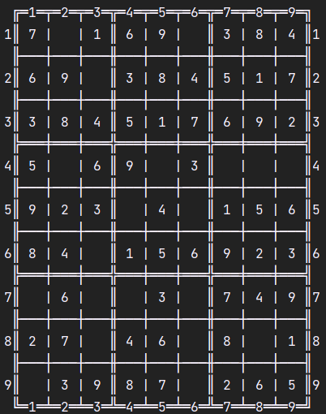
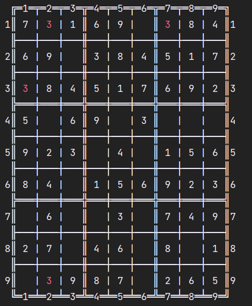
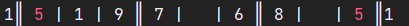

# CLI Sudoku

## Description

<a href="https://en.wikipedia.org/wiki/Sudoku" target="_blank">What is a Sudoku?</a>

### What can a user do with this program? 

__*Play a sudoku puzzle utilizing their Command Line.*__ <a href="https://youtu.be/v676LL1DYCQ" target="_blank">Demonstration video</a>

#### Optional difficulties

- Easy 
- Medium 
- Hard 

#### Optional actions

- Inserting a value to a specified cell - *in case it was not defined at the beginning of the game, regardless of whether it has a value at the moment*
- Deleting a value from a specified cell - *in case it was not defined at the beginning of the game*
- Undoing a defined number of steps - *up to the number of insertions and deletions done since the last restart or the beginning of the game*
- Asking for a hint - *in case there are no repetitions, the program gives a suggestion what values could be written to a cell, prioritizing the cells where the number of possible values is the lowest*
- Restarting the game - *the user will be prompted to confirm their command choice in order to avoid accidental restarts*
- Asking the program to finish the game - *after printing the solved the sudoku, the program finishes*

#### Non-optional functions

- The program highlights all values that collide with another value in their row, column or block with red colour.

## Implementation

### Technologies used
- sbt 1.9.8 (Oracle Corporation Java 21.0.1)
- Scala 3.3.1 (11.0.19, Java OpenJDK 64-Bit Server VM)

### Data structure choices

Numbers (and the lack of them) in the sudoku are represented as `Cell`s (= `Option[Int]`s).
They are stored in `Row`s (= `Vector[Cell]`), as they need to be sequenced and random access should be low-cost as insertions and deletions at any index will be frequent.
The sudoku itself consist of `Vector`s of `Row`s, as this is the most intuitive option of the logical units (row, column and block), furthermore this representation will be very easy to use when printing the state of the sudoku to the console.

The other logical units of sudokus (`Column`s and `Block`s) are also represented as `Vector[Cell]`s, as they are basically needed for the same validations as `Row`s.
They can easily be retrieved from the rows with the use of mathematical functions. 
We can define the set of coordinates of the nth column with the following formula: `{ (i,n) | i ∈ {0 to 8} }`
We can define the set of coordinates of the nth block with following formula: `{ ((n / 3 * 3 + i) | i ∈ {0,1,2} } x { ((n % 3 * 3 + i) | i ∈ {0,1,2} }`

In order to track changes in specified cells, and easily access them, type `Cellhistory = Vector[(Int, Int, Cell)]` is introduced. The first Int is the row index, while the second is the column index in the Tuples. 

### File structure

The project consists of the following files:
- Sudoku - *Definition of types and methods*
- Validation - *Function definitions for checking whether a logical unit consists valid values, is repetition-free and is solved*
- Solving - *Function definitions that are needed for solving the sudoku*
- Generate - *Function definitions that are needed for generating sudokus with a defined difficulty level*
- Pretty - *Function definitions needed for printing the current state of the sudoku to the console*
- PlaySudoku - *The core logic of the game, function definitions that parse and execute the user commands*
- Examples - *Sudokus that are used for testing the accuracy of functions*
- ValidationTests - *Unit tests for validation and solving methods*
- PlaySudokuTests - *Unit tests for the methods defined in PlaySudoku*
- main - *For running the game*
- Misc - *Prototypes or other functions that were not used in the final game but would not want to discard*
- README and intro - *Markdown files required for the SC50 Final Project Submission*


### Solving logic

The core logic of solving a sudoku is similar to a backtracking algorithm. It chooses an empty cell of the input sudoku, and fills all possible values creating new sudokus, which will be added to the sudokus to process. The previous state and all the newly generated unsolved sudokus are discarded. The tail-recursive function will call itself until a solved sudoku is found, or there are no more `sudokus that can be generated from the original input.

The time complexity of the algorithm is exponential but there are several heuristics, that aim to improve performance:
- The sudokus that are in a more advanced state - which take less steps to solve or to identify as unsolvable - are placed at the beginning of the list, and will consequently be used earlier.
- The function identifies the cells for which there are the least amount of possible values that could be filled in without causing repetitions and fills one of them first.
- By default, the algorithm fills only a single cell in every call, but this can lead to a lot of unnecessary validations. For instance, if the algorithm fills in a single-option cell it has to validate the sudoku before proceeding. Then, if the next cell also has only a single option, we have to fill and validate again. With sudokus in more advanced states, this can repeat over and over. Considering that the validation has to check every single cell of the sudoku, optimizing this step could enhance the performance considerably. Instead, we could simply keep filling the single-option cells (without validating) until we have no more. Then we only validate once, at the end.
- To discard the unsolvable sudokus, we check if there is at least one empty cell that can not be filled with any value without causing repetitions. This saves time of advancing unsolvable sudokus.
- Checking whether a sudoku is solved is only done when there are no empty cells in the sudoku.

### Generating logic

The same algorithm is used to generate sudokus as for solving them. If the function was initially given an empty sudoku, it would always generate the same sudoku. It is clear, that randomness needs to be built into the generating function, but if only one cell would be determined in the input of the function, it could only generate 9 different sudokus (since it can have 9 different values). If at least two random values are inserted, either the values need to be different, or the position has to be restricted (meaning they cannot be in the same row, column and block). I chose the latter, and decided that prefilling only 2 cells is not enough, as the games generated could still be too similar. If we want to insert more than 4 random values, in order to avoid generating unsolvable sudokus, we need to introduce more restrictions, since determining the locations of these only based on being in different rows, columns and blocks is not sufficient. 

For example in the below Sudoku, if a `1` would be placed in the middle block anywhere else than the location of the `2`, it would cause a repetition, therefore it is an unsolvable sudoku, even though all values are in different rows, columns and blocks.
```
 ╔═1═╤═2═╤═3═╦═4═╤═5═╤═6═╦═7═╤═8═╤═9═╗
1║   |   |   ║   |   |   ║   |   |   ║1
 ╟───┼───┼───╫───┼───┼───╫───┼───┼───╢
2║   |   |   ║ 1 |   |   ║   |   |   ║2
 ╟───┼───┼───╫───┼───┼───╫───┼───┼───╢
3║   |   |   ║   |   |   ║   |   |   ║3
 ╠═══╪═══╪═══╬═══╪═══╪═══╬═══╪═══╪═══╣
4║   | 1 |   ║   |   |   ║   |   |   ║4
 ╟───┼───┼───╫───┼───┼───╫───┼───┼───╢
5║   |   |   ║   | 2 |   ║   |   |   ║5
 ╟───┼───┼───╫───┼───┼───╫───┼───┼───╢
6║   |   |   ║   |   |   ║   | 1 |   ║6
 ╠═══╪═══╪═══╬═══╪═══╪═══╬═══╪═══╪═══╣
7║   |   |   ║   |   |   ║   |   |   ║7
 ╟───┼───┼───╫───┼───┼───╫───┼───┼───╢
8║   |   |   ║   |   |   ║   |   |   ║8
 ╟───┼───┼───╫───┼───┼───╫───┼───┼───╢
9║   |   |   ║   |   | 1 ║   |   |   ║9
 ╚═1═╧═2═╧═3═╩═4═╧═5═╧═6═╩═7═╧═8═╧═9═╝
```

As we previously chose that we do not restrict which values we use to fill the cells, we need to carefully choose the cells we will fill. For this, we will introduce the definition of a "blocked cell". We call a cell blocked if there is a filled Cell in the same row, column or block.

With this definition all the cells in the middle block of the above Sudoku are blocked. As we do not determine the value that will be filled to the specific cells, we have to avoid generating blocked blocks. We can ensure this by leaving all blocks empty that are affected by 2 rows and 2 columns. I chose the below layout for the positions of the determined cells:
```
 ╔═1═╤═2═╤═3═╦═4═╤═5═╤═6═╦═7═╤═8═╤═9═╗
1║ X |   |   ║   |   |   ║   |   |   ║1
 ╟───┼───┼───╫───┼───┼───╫───┼───┼───╢
2║   |   |   ║   |   |   ║   |   |   ║2
 ╟───┼───┼───╫───┼───┼───╫───┼───┼───╢
3║   |   |   ║   |   |   ║ X |   |   ║3
 ╠═══╪═══╪═══╬═══╪═══╪═══╬═══╪═══╪═══╣
4║   | X |   ║   |   |   ║   |   |   ║4
 ╟───┼───┼───╫───┼───┼───╫───┼───┼───╢
5║   |   |   ║   | X |   ║   |   |   ║5
 ╟───┼───┼───╫───┼───┼───╫───┼───┼───╢
6║   |   |   ║   |   |   ║   |   |   ║6
 ╠═══╪═══╪═══╬═══╪═══╪═══╬═══╪═══╪═══╣
7║   |   |   ║   |   |   ║   |   |   ║7
 ╟───┼───┼───╫───┼───┼───╫───┼───┼───╢
8║   |   |   ║   |   | X ║   |   |   ║8
 ╟───┼───┼───╫───┼───┼───╫───┼───┼───╢
9║   |   |   ║   |   |   ║   |   | X ║9
 ╚═1═╧═2═╧═3═╩═4═╧═5═╧═6═╩═7═╧═8═╧═9═╝
```
In the below graphics
- X means, that the Cell is filled in
- the horizontal lines mark the blocked rows
- the vertical lines mark cells blocked by the columns
- the slant lines mark the cells only blocked by the blocks
- Empty cells show where any value can be written
This showcases the most restricted version of this sudoku, where all inserted values are the same. If any of the values inserted differs, the options will be less restricted, therefore filling these coordinates should not result in unsolvable sudokus.
```
 ╔═1═╤═2═╤═3═╦═4═╤═5═╤═6═╦═7═╤═8═╤═9═╗
1║ ╳ | ┼ | ─ ║ ─ | ┼ | ┼ ║ | ┼ ─ | ┼ ║1
 ╟───┼───┼───╫───┼───┼───╫───┼───┼───╢
2║ | | | | \ ║   | | | | ║ | | \ | | ║2
 ╟───┼───┼───╫───┼───┼───╫───┼───┼───╢
3║ ┼ | ┼ | ─ ║ ─ | ┼ | ┼ ║ ╳ | ─ | ┼ ║3
 ╠═══╪═══╪═══╬═══╪═══╪═══╬═══╪═══╪═══╣
4║ ┼ | ╳ | ─ ║ ─ | ┼ | ┼ ║ ┼ | ─ | ┼ ║4
 ╟───┼───┼───╫───┼───┼───╫───┼───┼───╢
5║ ┼ | ┼ | ─ ║ ─ | ╳ | ┼ ║ ┼ | ─ | ┼ ║5
 ╟───┼───┼───╫───┼───┼───╫───┼───┼───╢
6║ | | | | \ ║ \ | | | | ║ | |   | | ║6
 ╠═══╪═══╪═══╬═══╪═══╪═══╬═══╪═══╪═══╣
7║ | | | |   ║ \ | | | | ║ | | \ | | ║7
 ╟───┼───┼───╫───┼───┼───╫───┼───┼───╢
8║ ┼ | ┼ | ─ ║ ─ | ┼ | ╳ ║ | ┼ ─ | ┼ ║8
 ╟───┼───┼───╫───┼───┼───╫───┼───┼───╢
9║ ┼ | ┼ | ─ ║ ─ | ┼ | ┼ ║ ┼ | ─ | ╳ ║9
 ╚═1═╧═2═╧═3═╩═4═╧═5═╧═6═╩═7═╧═8═╧═9═╝
```

For this reason, the above positions are filled with random values between 1 and 9 in the input sudoku of the generating function. This way it can generate 9 to the power of 6 (= 531441) different sudokus which in my opinion is sufficient for this game. `System.nanoTime()` is used as the seed of random generation (but it can be configured freely).

### Visual representation

| The sudokus are visually represented as seen below: | In case there are repetitions in the rows, columns or blocks, all numbers are highlighted with RED ANSI colour when printing the sudoku to the console. It looks like this when being printed: |
|-----------------------------------------------------|------------------------------------------------------------------------------------------------------------------------------------------------------------------------------------------------|
|              |                                                                                                                                                       |
ANSI (The American National Standards Institute) provides colour standards, for which there are escape sequences and colour codes defined, that can be embedded into the text to colour parts of it.
The unicode escape sequence is `\u001B`. The ANSI colour codes start with this escape code, for example the code for red is `\u001B[31m`, while the reset code is `\u001B[0m`. If we want to colour some text red, we need to insert the code for red before it, and the reset code after it. The reset code is needed to switch back to the default colour for the following text.
For example to print this:  we could write the following code:
``` 
"1║ " + "\u001B[31m" + "5" + "\u001B[0m" + " | 1 | 9 ║ 7 |   | 6 ║ 8 |   | " + "\u001B[31m" + "5" + "\u001B[0m" + " ║1"
```
This way if we collect the coordinates repetitive values, we can colour them while pretty printing.

### CLI interface

The main loop of the game firstly attempts to parse the user command, and if the parsing was successful, it will execute it. The outcome of one loop could either be an error message or a new state of the sudoku. The function returns when the sudoku is solved.

This main loop relies on the following data:
- the current state of the sudoku - *which will be the input of the command to be executed*
- the starting state of the sudoku - *as the cells that are defined at the beginning cannot be changed, furthermore the starting sudoku is utilized by the restart command*
- past changes of the sudoku - *documenting the values the insertions and deletions are changing are needed for the implementation of the undo command.*

In the main loop the parsing and the execution of a user command are completely separated thanks to using an algebraic data type. This enables us to test the parsing and execution functions separately and if there were several developers working on this project, the parsing could have been developed in parallel with the execution. Lastly as `Command` is a sealed trait, commands can only be defined in this file.

The user inputs are parsed in several steps, and can return either an error message or a command. If the parsing is successful, an execution function uses pattern matching on the command, which will already have all the relevant information in its fields. This way one function can easily execute all the commands. 

Regarding the undo command: we use a LIFO data structure to track the changes when an insertion or deletion is executed.
The previous state of the changed cell is added to the beginning of this data structure, and when the user executes the undo command, it restores the affected cells to their previous values.

An alternative design choice could be storing the past states of the whole sudoku. In this case when using the undo command, we could just set the current sudoku to a previous state. With this structure we would need to store the whole sudokus, not only coordinates and values. The tradeoff is that with storing the whole sudokus the implementation of the undo command is simpler, however this choice requires more data storage. Meanwhile, with storing only the coordinates and values of the changed cells, the undo command might execute a few cell updates, but will need less storage.

### Possible features to be added in the future

- Players could save and load their own games.
- Further unit tests could be added to check the statistics of generating sudokus, and with the help of these the function could be enhanced more easily.
